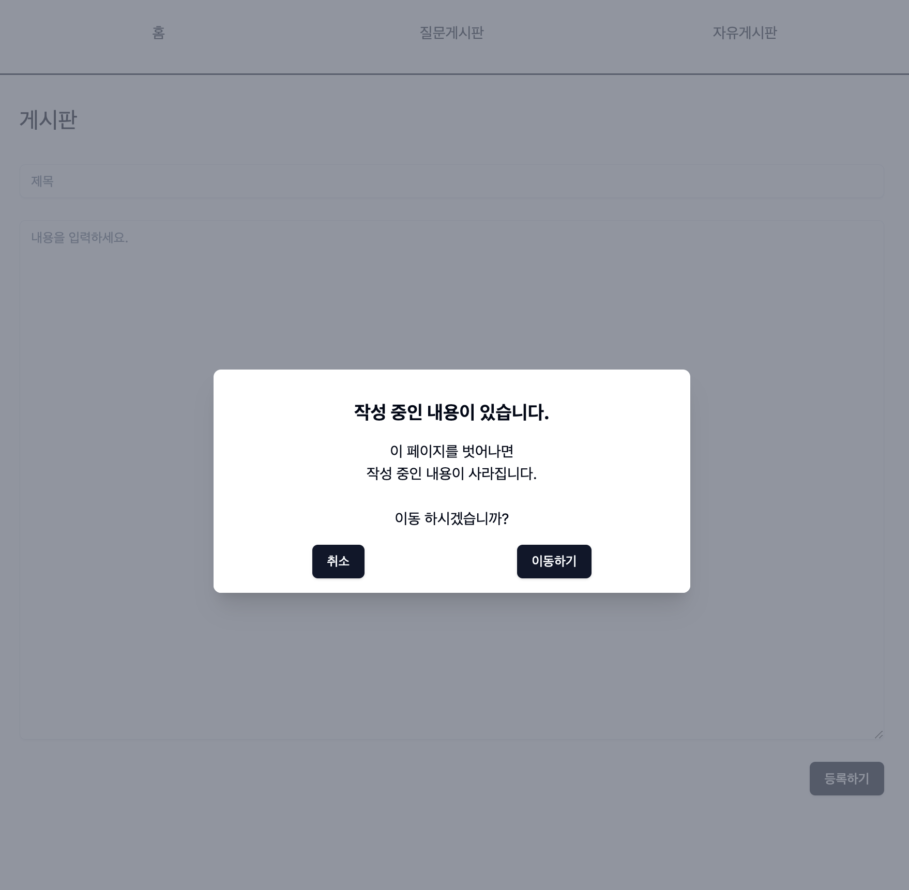

# Issue Dashboard

GitHub API를 사용한 대시보드

## 기본 요구 사항

### SPA 사이트 제작

- 게시판 API 는 Github issue API 를 활용
  - 2개 저장소 활용 / 각각의 저장소를 질문 게시판

- Github API Reference : https://docs.github.com/en/rest
  - 페이지네이션: https://docs.github.com/en/rest/guides/using-pagination-in-the-rest-api
  - 이슈 목록: https://docs.github.com/en/rest/search#search-issues-and-pull-requests
  - 이슈 상세: https://docs.github.com/en/rest/issues/issues#get-an-issue
  - 이슈 등록: https://docs.github.com/en/rest/issues/issues#create-an-issue

### 공통 모달

- 각 페이지에서 각자 모달을 관리하지 않고 공통 기능으로 제공
- 모달로 사용할 컴포넌트를 전달 받도록 함
- 모달 오픈 시 바닥 스크롤 제한
- 포커스 트랩
- 모달 클로즈 시 이전 포커스 복귀
- 모달 스택 관리
- 라우트 이동 시 전체 모달 클로즈 처리

### 공통 알럿/컨펌

- 위 공통 모달 기능을 이용하여 공통 알럿/컨펌 기능 추가
- 메시지, 버튼 명 등을 커스텀할 수 있도록 함

## 추가 요구 사항

### 편집 중 라우트 제한 기능

- 편집 화면을 보는 중 페이지를 이탈하려 하면 사용자 컨펌을 보여주고 사용자 선택에 따라 라우트를 진행/취소
- SPA 라우트 내부에서는 공통 모달 기능으로 노출
- SPA 라우트를 벗어나는 경우 브라우저 기본 이벤트 사용
- 각 페이지에서 페이지 이탈 기능 사용 여부, 현재 편집 상태만 알려주면 손쉽게 활용할 수 있도록 해야 함
게시판 글 쓰기에 사용

## 기술 스택

- 번들러: [ViteJS + ReactTS](https://vitejs.dev/)
- UI 라이브러리: [shadcn/ui](https://ui.shadcn.com/)
- 패키지 매니저: [pnpm](https://pnpm.io/)

## 시작하기

### 1. 프로젝트 디렉토리 이동

 ```bash
 cd issue-dashboard
 ```

### 2. 종속성 설치

```bash
pnpm install
```

### 3. 실행

```bash
pnpm run dev
```

### 4. 브라우저에서 <http://localhost:5173> 접속

 환경에 따라 포트가 변경될 수 있음

## 작업 화면

### 홈 화면


### 게시판 화면


### 뷰어 화면





